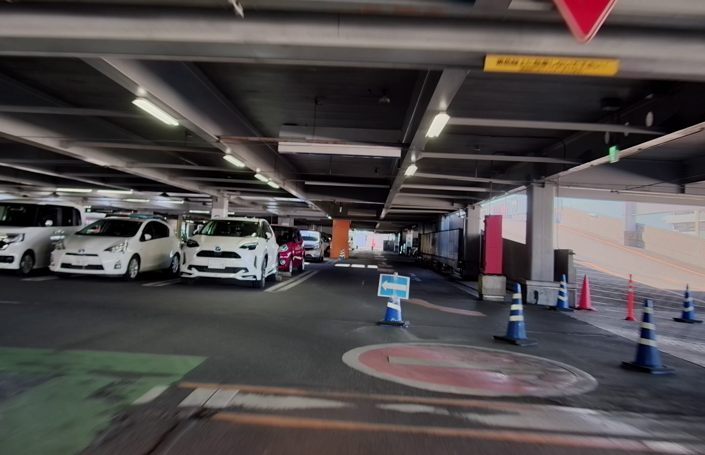

# C2_camera_playgrounds
## 光源と法線推定による深度推定  
TIER IV C2カメラはC1に引き続き，光学的に良好な特性を持つカメラであることが確認できた．ここにテスト用コードとともに，良好な特性結果をここに簡易にまとめた．

組み込み向けCPUなど処理能力やメモリといったリソースが比較的少ないデバイスでのコンピュータビジョンにも利用できそうである．
(組み込み機器にGMSL2インターフェースがあるのかという議論はまた別であるし，USB変換も可能であるのでここでは取り上げない)

ここでは順に
- コードの動かし方
- 調整方法
- 使用機材
- C2カメラについて
- 技術的背景
- 結論

を取り上げていく．

## コード
### フィルタによる深度推定手法
ここからはすべてTIER IV C2カメラで撮像した映像を前提とする．他の撮像デバイスから取得した映像は，ここにあげたコードでの動作は推奨されない．

なお，下記説明はオフラインのMATLABでの動作を前提としているが，[ブラウザからMATLAB Onlineでも動作確認ができる](https://matlab.mathworks.com/open/github/v1?repo=panda5mt/C2_cam_playgrounds&file=./main1.m)
．アカウントを取得済みであれば，即導入できるので是非試していただきたい． (Thanks [@minoue-xx](https://github.com/minoue-xx))

https://matlab.mathworks.com/open/github/v1?repo=panda5mt/C2_cam_playgrounds&file=./main1.m
1. 静止画での深度推定
    - 動作確認

        元の画像は以下のものを使用する．
    

        [main1.m](./main1.m)をMATLAB/MATLAB onlineで実行する．

        下記Figureが出現する．
    
        カラーマップは赤色になるほどカメラに近く，水色ほど遠ざかる．(物体は焦点面よりもレンズから遠ざかっているものとする) ナンバープレートは加筆で消したため，その部分の深度推定ができなくなっている模様である．ご了承いただきたい．
    - パラメータ調整

        <!-- [深度適用時のフィルタ長さNと物体の閾値thres](https://github.com/panda5mt/depth_estimate_blur/blob/main/main.m#L7-L11)を調整することができる． $N$ は解像度が高いときは大きめ，解像度低めの際は小さめにすると良好な特性が得られることが多い． ( $4\le N \le 25$ )．
    
        <!-- 物体が存在していないはずのところを深度推定している場合は $thres$を0より大きくすると解決することがある．( $0\le thres \le N^2 \times \frac{1}{2}$) --> -->

### Francott-Chellappaを用いた周波数領域からの深度推定
<!-- 離散コサイン変換(DCT)を利用し，sparse(疎)な深度推定とdense(密)な深度推定を行う手法．画像を8x8のブロックに分割しDCTを適用し，条件に応じて，疎，密それぞれを計算する．工夫次第では扱うデータを1/64まで圧縮できるので，限られたメモリの環境ではこちらの手法を取ることも考えられる． -->

## TIER IV C2カメラとは
- [自動運転&モビリティ向け車載HDRカメラ](https://www.paltek.co.jp/solution/tier4/index.html)だよすごいねぇぇぇぇぇぇ．
    TODO: 後で真面目に書く

## 映像を撮影，録画した環境について
- TIER IV C1カメラ(FoV:85deg)
- レッツノートQV1 (Win11)標準のカメラアプリ．[GMSL2-USB3変換](https://tier4.github.io/camera_docs/usb_convert_jp/)を経由している．
- SUZUKI Swift Sport ZC33S(屋根上15cm) / Swift RS ZC83S(車内フロントガラス貼り付け)

## 結論 
チューニングされたThin lens modelに従う複合レンズと，HDRイメージセンサを搭載したC1カメラを簡易評価した．優れた光学的特性，そしてイメージセンサのダイナミックレンジにより，単純なロジックでも深度推定が可能であることを示した．

ADASも含め，ロボティクス方面でカメラを利用したり，工場内移動ロボット(群ロボ)などコンピュータリソースが潤沢にない環境で画像処理をする分野で威力を発揮するものと思われる．