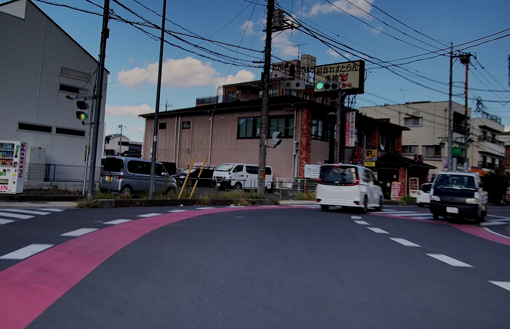
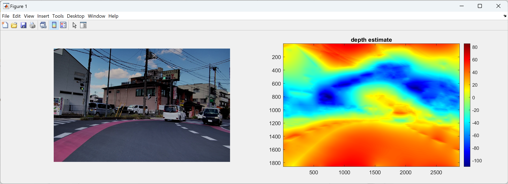

# C2_camera_playgrounds
## Francot-Chellappaアルゴリズムによる深度推定  
TIER IV C2カメラはC1に引き続き，光学的に良好な特性を持つカメラであることが確認できた．今回はShape from Shadings(SfS)手法を用いた．ここにテスト用コードとともに，良好な特性結果をここに簡易にまとめた．

処理能力やメモリといったリソースが比較的少ないデバイスでのコンピュータビジョンにも利用できそうである．

ここでは順に
- コードの動かし方
- 調整方法
- 使用機材
- C2カメラについて
- 技術的背景
- 結論

を取り上げていく．

## コード
ここからはすべてこの実験で使用したTIER IV C2カメラで撮像した映像を前提とする．他の撮像デバイスや環境で取得した映像は，ここにあげたコードでの動作は推奨されない．

なお，下記説明はオフラインのMATLABでの動作を前提としているが，ブラウザからMATLAB Onlineでも動作確認ができる．Mathworksアカウントを取得済みであれば，即導入できるので是非試していただきたい．

- 静止画深度推定: 

- 動画の深度推定:
    

1. 静止画での深度推定
    - 動作確認

        元の画像は以下のものを使用する．
    

        [main1.m](./main1.m)をMATLAB/MATLAB onlineで実行する．

        下記Figureが出現する．
    
        カラーマップは赤色になるほどカメラに近く，水色ほど遠ざかる．別途台形補正などで道路検出を行った方がよいと思われる．

    - パラメータ調整
        正確な光源の推定がこのアルゴリズムの要といえる．今回はその手法の提案を手短に提示するにとどめる．詳細は後述．項目2出示すように，簡易的に光源を推定し，その結果の中央値を出す方法も有効かもしれない

2. 動画での深度推定

    連続した画像から深度を推定することが実運用では多いと思われる．1フレームごとに光源推定をおこなうと，時々大きく外れた推定結果を出すことがある．これを避けるため，今回は深さ10で光源位置をバッファリングし中央値から光源位置を求めた．
    - 動作確認
    [main2_video.m](./main2_video.m)をMATLAB/MATLAB onlineで実行する．

    変換には時間を要するため，結果を動画としてアップしてある．

https://github.com/panda5mt/C2_cam_playgrounds/assets/792481/924420ab-3056-4dd1-a554-4f8657ee2575

## TIER IV C2カメラとは
- [自動運転&モビリティ向け車載HDRカメラ](https://www.paltek.co.jp/solution/tier4/index.html)だよすごいねぇぇぇぇぇぇ．
    TODO: 後で真面目に書く

## 映像を撮影，録画した環境について
- TIER IV C2カメラ
- レッツノートQV1 (Win11)標準のカメラアプリ．[GMSL2-USB3変換](https://tier4.github.io/camera_docs/usb_convert_jp/)を経由している．
- SUZUKI Swift Sport ZC33S(ボンネット上15cm) / Swift RS ZC83S(同左)

## 技術的背景
### まず必要なのは光源座標と法線マップ
単位光源ベクトルを $s$ 物体表面の単位法線ベクトルを $n$
，物体表面の反射率を $\rho$ 
とするとき，その点での明るさ $i$ は以下のようになる

$i=\rho n\cdot s$

つまり，明るさと反射率が既知であれば法線マップが生成可能である．

正確に法線マップを取得するには照度差ステレオなどの手法を取るか，比較的単純な機械学習，あるいは別の光センサからの光源情報をも利用し拡張カルマンフィルタを用いた光源推定を実行するのが望ましい．今回は簡易実験のため，簡易的なアルゴリズムで推定している(こちらは非公開)．<b><u>実運用に供する場合は各自光源検出アルゴリズムを開発されることを強く勧める．</u></b>

### Francott-Chellappaを用いた周波数領域からの深度推定
法線マップは画像やテクスチャ内の各ピクセルが示す表面の法線ベクトルの方向をピクセルごとに収めたものといえる．
この情報を深度情報に変換するまでの概要は以下の通り

- 法線マップから勾配を取得
- 勾配をフーリエ領域に変換

    x軸とy軸の勾配をそれぞれフーリエ変換して，周波数領域の表現にする

- 伝達関数を適用

    勾配情報を持つフーリエ領域のデータに，周波数応答(伝達関数)を適用．この伝達関数は，勾配情報を統合して連続的な深度マップを生成するためのものである．

- フーリエ逆変換

    前のステップで得られたフーリエ領域のデータを逆変換し，画像領域の深度マップを取得．

## 結論 
明度バランスが絶妙に調整されていて，HDRイメージセンサを搭載したC2カメラを簡易評価した．優れた光学的特性，そしてイメージセンサのダイナミックレンジにより，単純なロジックでも深度推定が可能であることを示した．

ADASも含め，ロボティクス方面でカメラを利用したり，工場内移動ロボット(群ロボ)などコンピュータリソースが潤沢にない環境で画像処理をする分野で威力を発揮するものと思われる．

## 参考文献
- Robert T.Frankot, <i>et al.</i> [Method for Enforcing Integrability in Shape from Shading Algorithms](https://www.researchgate.net/publication/3191576_A_Method_for_Enforcing_Integrability_in_Shape_from_Shading_Algorithms/link/55a7a2d908ae345d61db624c/download)
